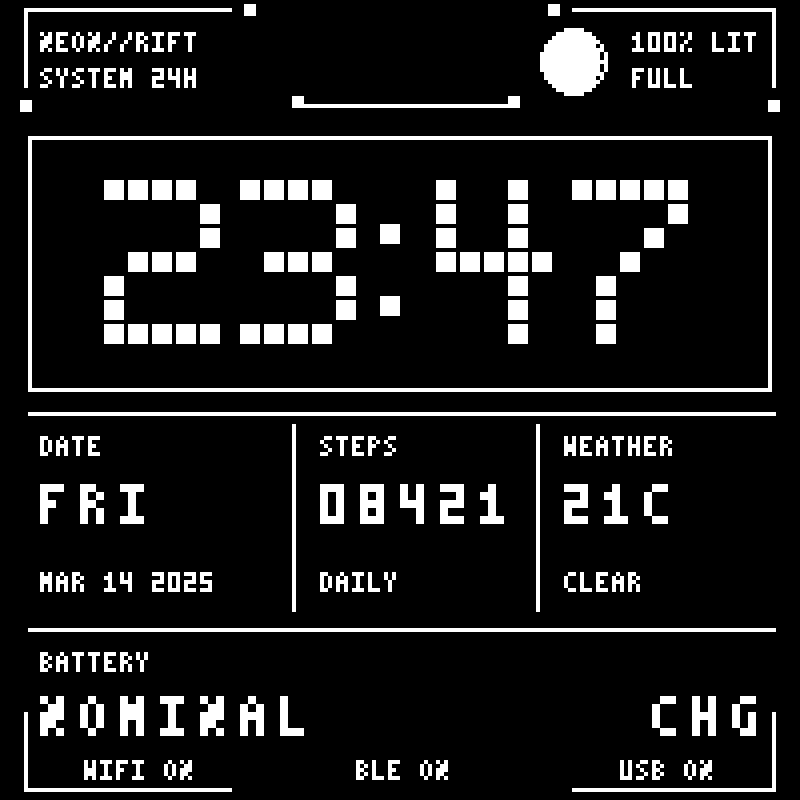
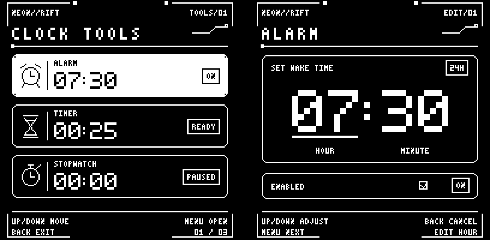

# NeonRift

A native-resolution monochrome Watchy face with a restrained cyberpunk
instrument-panel style. Readability and watch data take priority over decoration.
It shows:

- 24-hour time
- day, date, and year
- lunar phase and illumination percentage
- step count
- local temperature fallback and key-free live weather for a configured postal code
- LOW / NOMINAL / HIGH battery voltage band and a separate CHG indicator
- Wi-Fi, Bluetooth, and USB power status (USB power is available on Watchy v3)

The artwork is drawn with display primitives and two tiny bitmap fonts, so the
face has no external asset or font dependency.



## Install

1. Open `NeonRift.ino` in Arduino IDE.
2. Set `POSTAL_CODE` and the two-letter `COUNTRY_CODE` in `settings.h`.
3. Choose `metric` or `imperial` with `WEATHER_UNIT`.
4. Leave `ENABLE_AUTO_WEATHER` set to `0` to avoid weather traffic.
5. Leave `ENABLE_AUTO_NTP` set to `1` for a small daily time sync, or set it to
   `0` for completely offline operation.
6. Select your Watchy board and upload.

## Compile with Devbox

The repository includes a reproducible Arduino CLI environment using the same
ESP32 core version as CI. Install the board core and libraries once, then build
the revision matching your hardware:

```sh
devbox run setup
devbox run build-v10 # Watchy PCB v1.0
devbox run build-v20 # Watchy PCB v2.0
devbox run build-v30 # Watchy PCB v3.0 / current SQFMI-WATCHY-10
```

Firmware binaries are written under `.devbox/build/<revision>/`.

Automatic weather is disabled by default for maximum stability. The face uses
its onboard temperature sensor and performs only a daily NTP sync. On Watchy
v3, automatic NTP waits for USB power to avoid battery-side Wi-Fi current
spikes; the RTC keeps time between syncs. A failed NTP sync is retried after one
hour, not on every minute wake. Set `ENABLE_AUTO_NTP` to `0` for completely
offline operation. Wi-Fi menu actions remain available.

When `ENABLE_AUTO_WEATHER` is set to `1`, NeonRift resolves the postal code
through [Zippopotam.us](https://www.zippopotam.us/), then gets current weather and the local UTC offset from
[Open-Meteo](https://open-meteo.com/). Neither service requires an API key.
The resolved coordinates are stored in ESP32 NVS and reused through power
cycles; a successful lookup runs again only when the postal or country setting
changes. Failed requests are retried no more than once per weather interval.
Weather refreshes every three hours by default. NTP synchronizes daily, or
immediately when the resolved timezone offset changes for travel or daylight
saving time. Both intervals are configurable in `settings.h`.
If an update fails, the last successful weather reading remains visible and is
marked `STALE`; before the first successful update, the display falls back to
Watchy's onboard temperature as `LOCAL`. Timekeeping continues with the
configured or most recently resolved UTC offset.

## Battery readings

The face shows broad voltage bands instead of a percentage or progress bar:

- `LOW`: below 3.60 V
- `NOMINAL`: 3.60 V to below 3.90 V
- `HIGH`: 3.90 V or above, or a saturated ADC reading
- `UNKNOWN`: invalid voltage reading

`CHG` appears separately at the right while charging. Charger status never
changes the battery category, and `HIGH` does **not** mean fully charged.
These are rough voltage indicators, not remaining-runtime estimates.

Watchy v3 has a measurement-range limitation: its 100k/360k divider feeds
about 3.29 V into the ESP32-S3 ADC at a 4.20 V battery voltage, above the
ADC's specified 3.1 V range. A clipped reading around 3.9 V maps to roughly
65–70% on the LiPo curve even when the battery is full. Averaging does not
recover the missing voltage information.

When repeated raw samples hit the ADC rail, the face shows `HIGH`. In **About
Watchy**, `V+` and `ADC at limit` confirm clipping. This is not evidence of a
battery that failed to charge. It also cannot prove the battery is full.
Accurate upper-range voltage readings require a hardware divider with more
attenuation or a fuel gauge. Charging voltage, load, temperature, and cell
aging still affect the category.

References: [Watchy v3 schematic](https://github.com/sqfmi/Watchy-Hardware/blob/v3.0/WatchySchematic.pdf)
and [ESP32 ADC ranges](https://docs.espressif.com/projects/arduino-esp32/en/latest/api/adc.html#analogsetattenuation).

## Preview

`NeonRift-preview.png` is an 800x800 nearest-neighbor preview of the native
200x200 e-paper output. Regenerate both the high-resolution preview and the
catalog screenshot with:

```sh
python3 render_preview.py
```

The preview uses a representative time, date, step count, network state, and
a `NOMINAL` battery while charging (`CHG` and `USB ON`). The hardware face
replaces those values with live readings.

### Clock-tools screens

Clock Tools uses NeonRift's fonts, chamfered cards, inverted selection, status
badges, and compact button hints. The menu, alarm editor, timer editor/running
view, stopwatch, and alert screen share the renderer in `src/ClockToolsUI.h`.
Selected hours/minutes are underlined; the alarm's enabled row is inverted
when editing its state. Button hints change from Next to Save/Start as needed.

In the alarm and timer editors, **UP increases** the selected number and
**DOWN decreases** it. Hours wrap between 23 and 0, minutes between 59 and 0;
fields wrap independently. Save/cancel behavior, RTC timing, persistence, and
refresh cadence are unchanged. Timer and stopwatch values remain **HH:MM**, not MM:SS; the
running timer rounds remaining minutes up, and the stopwatch displays whole
elapsed minutes. No extra display or radio wakeups are introduced.

These images use sample values, not live readings. Host tests compare their
pixels against the actual firmware renderer, including each selection/edit
state and long stopwatch values. Upload a new board-specific build to apply
the styling to your watch.



The four-screen gallery is `ClockTools-screens-preview.png`. Regenerate it,
the paired preview, and individual 800x800 screens with:

```sh
python3 render_clock_tools_preview.py
```

Run the rendering and button-control regressions from the repository root
(with Python and g++ installed):

```sh
python3 -m unittest discover -s tests -v
```
